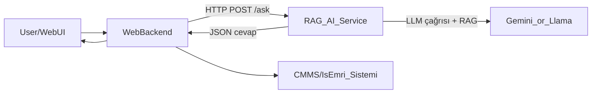

## Engenius RAG – Web Entegrasyon ve Görev Paylaşımı Planı

### 1. Genel Mimari

- **Hedef yapı**: Arkadaşının RAG sistemi bir **AI servis** (mikroservis) olarak çalışacak, senin web uygulaman ise bu servise **HTTP (REST) üzerinden** soru sorup cevap alacak.
- **Versiyonlar**: 
  - Cloud modu: Mevcut `app_gemini.py` ve `src/rag_engine.py` kullanılarak.
  - Offline modu: `app_llama.py` ve `src/llama_engine.py` kullanılarak; ikisi de aynı API yüzeyine oturtulacak.
- **Web tarafı**: Senin tarafında, mod seçimi (kısa/detaylı/iş emri), kullanıcı rolü, makine bilgisi gibi parametreleri toplayan bir UI + bu parametreleri RAG servisine gönderen bir backend katmanı olacak.

---

### 2. Arkadaşının Yapacakları (Minimum Yük)

1. **Mevcut RAG motorunu bir kütüphane gibi ayırmak**
  - `src/rag_engine.py` ve `src/llama_engine.py` içinde hali hazırda soru alıp cevap üreten fonksiyonu netleştirmek (ör. `answer_question(query, mode, context)` gibi).
  - Bu fonksiyonun, çağıran tarafa **metin + yapılandırılmış JSON** döndürecek şekilde standardize edilmesi.
2. **Hafif bir API katmanı eklemek (tek dosya)**
  - Örn. `api.py` içinde `FastAPI` veya `Flask` ile:
    - `POST /ask` endpoint’i: input olarak `question`, `mode`, `machine_id`, `user_role`, vb. alıp, arkadaki `rag_engine` fonksiyonuna iletir.
    - Cevap olarak, hem insan okunur metni, hem de `work_order_suggestion` gibi alanları içeren JSON döner.
  - İmkan varsa basit bir `healthcheck` endpoint’i (`GET /health`) eklemek.
3. **RAG motorunun mod parametresini desteklemesi**
  - Mode türleri: `short`, `detailed`, `work_order`.
  - Prompt içinde bu modlara göre çıktı tarzını ayarlayan küçük kuralları eklemek (kısa, detaylı, iş-emri formatlı + JSON şema).
4. **Saha tecrübelerini yazmak için tek bir “öğrenme” endpoint’i tanımlamak (opsiyonel)**
  - Basit `POST /learn`:
    - Input: soru, uygulanan çözüm, başarı durumu, tarih, makine bilgisi.
    - Bu endpoint içeride zaten var olan “hafıza güncelleme / RAG index güncelleme” mekanizmasını tetikler.
5. **Model bağımsızlık noktası**
  - Gemini/LLama farkını `rag_engine` içindeki bir adapter veya ayar ile çözmek; dış API’ye aynı imzayı vermek.
  - Böylece senin web tarafının hiç “Gemini mi Llama mı?” ile uğraşmaması.

---

### 3. Senin Yapacakların (Web ve Orkestrasyon Tarafı)

1. **Web arayüzünde mod seçici ve giriş formu tasarlamak**
  - Kullanıcı seçimleri:
    - Mod: `Kısa Cevap`, `Detaylı Cevap`, `İş Emri Modu`.
    - Soru metni (zorunlu).
    - Makine/hat seçimi (drop-down veya ID).
    - Kullanıcı rolü (operatör/bakım mühendisi vb.) – opsiyonel ama çok faydalı.
2. **Web backend’inde RAG servisine bağlanan bir client yazmak**
  - Seçilen mod ve formdaki verileri **JSON body** olarak `POST /ask` endpoint’ine gönderen fonksiyon.
  - Zaman aşımı, hata yönetimi (AI servisi cevap vermezse anlamlı hata gösterimi) ayarları.
3. **Dönen JSON’u işleyip UI’de gösterme kuralları**
  - `short_answer` alanı → Kısa modda kart şeklinde göster.
  - `detailed_answer` alanı → Detaylı modda markdown/tabs ile göster.
  - `work_order_suggestion` doluysa:
    - Adımlar, süre, gerekli rol/material listesi gibi bilgileri “İş Emri Taslağı” panelinde göster.
    - “Onayla ve İş Emri Aç” butonu ekle.
4. **İş emri sistemi (CMMS) ile entegrasyon**
  - “İş Emri Aç” butonuna basıldığında, `work_order_suggestion` verilerini:
    - Var olan CMMS API’nize veya kendi veritabanınıza kaydeden backend fonksiyonu.
  - Cevap olarak dönen iş emri ID’sini chat ekranında gösterme (örn. “İş emri #12345 olarak açıldı”).
5. **Saha tecrübesi geri bildirimi akışı**
  - Cevap kartının altına “Bu çözüm işe yaradı / yaramadı” butonları eklemek.
  - Kullanıcı tıkladığında, web backend’in `POST /learn` endpoint’ine durumu iletmesi (soru, cevap, sonuç).
6. **Kimlik ve güvenlik (temel)**
  - RAG servisine yapılan isteklerde bir `API_KEY` veya servisler arası basit bir shared secret kullanmak.
  - Sadece senin web backend’inin o servise doğrudan erişebilmesini sağlamak (kullanıcının tarayıcısından değil).

---

### 4. Ortak Çalışma Mantığı (Özet Akış)

1. Web kullanıcısı, sitendeki AI sayfasında:
  - Modu seçer (kısa/detaylı/iş emri),
  - Sorusunu ve ilgili makineyi girer.
2. Senin web backend’in:
  - Bu isteği RAG servisinin `POST /ask` endpoint’ine iletir.
3. Arkadaşının RAG servisi:
  - Agentic router + hibrit arama (vektör + BM25 + RRF) + görsel çıkarım adımlarını çalıştırır.
  - Mod’a uygun metinsel cevap + yapılandırılmış JSON üretir.
4. Web backend:
  - JSON’u parse eder, UI’de ilgili kartları oluşturur.
  - `work_order_suggestion` varsa, CMMS entegrasyonuyla gerçek iş emrine dönüştürebileceğin bir aksiyon butonu sunar.
5. Kullanıcı çözümü dener ve geri bildirim verir:
  - “İşe yaradı / yaramadı” gibi sinyal, `POST /learn` ile arkadaşının sistemine gider ve hafıza güncellenir.

---

### 5. Ekler – Llama Kurulumu ve Ücretsiz Model Seçenekleri

- **Llama kurulumu kimin yapması gerektiği**:
  - Teknik olarak, senin bilgisayarında da `Ollama` veya benzeri bir araçla Llama/Mistral/Qwen gibi modelleri kurup çalıştırabilirsin; bu tamamen Python ve komut satırı ile yapılabilen bir iş, arkadaşının makinesine bağımlı değilsin.
  - Ancak mevcut `app_llama.py` ve `src/llama_engine.py` nasıl konfigüre edilmişse, ilk kurulumu ve doğru model/quant ayarlarını büyük ihtimalle arkadaşının yapması daha hızlı olur; sonrasında sen de dokümantasyonla aynı adımları kendi ortamında tekrarlayabilirsin.
- **Gemini yerine ücretsiz / sınırsıza yakın alternatifler**:
  - Tam anlamıyla “sınırsız ve tamamen ücretsiz, bulut tabanlı” bir LLM yok; tüm büyük sağlayıcılar ya kota ya da ücretli plan kullanıyor.
  - **Gerçek anlamda özgürlük için en mantıklısı**: RAG motorunu, **yerel çalışan open-source modellerle** kullanmak:
    - `Ollama` ile: Llama 3, Mistral, Qwen, Phi-3 vb. modelleri indirebilirsin; kullanım başına ek ücret ödemezsin, sadece kendi donanım gücüne bağlı olursun.
    - GPU veya güçlü CPU varsa, bakım senaryoları için orta boy bir model (örn. 8B–14B) genelde yeterli olur.
  - Cloud tarafında düşük maliyetli alternatifler olarak: OpenAI, DeepSeek, Groq gibi servisler düşünülebilir ama bunların hiçbiri “istediğimiz kadar, sıfır maliyet” garantisi vermez; hepsi API kullanımına göre ücretlendirir.

Bu planı onaylarsan, bir sonraki adımda istersen örnek bir `POST /ask` istek/cevap şeması ve JSON alan isimlerini birlikte netleştirebiliriz.

